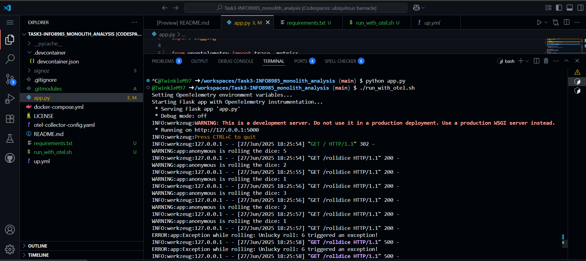

# INFO8985_monolith

This project demonstrates how to instrument a Python **monolithic Flask app** using **OpenTelemetry** for logging, tracing, and metrics, and visualize them in **SigNoz**.

## Extended the base project by:

1. Configuring the Flask app to export:
   - Traces (`opentelemetry-sdk`, `opentelemetry-exporter-otlp-proto-http`)
   - Logs (including custom exceptions)
   - Metrics (e.g. `dice.rolls` counter)

2. Integrated SigNoz using Docker Compose for:
   - Otel Collector
   - ClickHouse + Query Services
   - UI Dashboard

3. Created a `roll()` function that throws an exception when the dice roll is 6, and ensured:
   - The exception is logged and traced in SigNoz
   - It is not silently swallowed (user sees a 500 error both in terminal and in the browser)

4. Added a reusable shell script `run_with_otel.sh` to consistently launch the instrumented app with all exporters enabled.

5. Access URL for Codespaces: the app can be accessed at:
   ```
   https://<your-codespace-name>-5000.app.github.dev/rolldice
   ```

6. Captured key screenshots proving successful integration (see below).

---

## Docker Compose Setup

```bash
cd signoz/deploy/docker
docker-compose up -d
```

This launches the SigNoz stack (Otel Collector, ClickHouse, Frontend UI).

---

## Running the Instrumented Flask App

### With Bash Script from root folder (Recommended)
```bash
chmod +x run_with_otel.sh
./run_with_otel.sh
```

### Alternatively, run manually:
```bash
export OTEL_LOGS_EXPORTER=none
export OTEL_TRACES_EXPORTER=otlp
export OTEL_METRICS_EXPORTER=otlp
export OTEL_EXPORTER_OTLP_ENDPOINT=http://localhost:4318
export OTEL_EXPORTER_OTLP_PROTOCOL=http/protobuf
export OTEL_PYTHON_LOGGING_AUTO_INSTRUMENTATION_ENABLED=true
export FLASK_APP=app.py

opentelemetry-instrument \
  --logs_exporter otlp \
  --metrics_exporter otlp \
  --traces_exporter otlp \
  --service_name monolith-analysis \
  python -m flask run -p 5000
```

Access the app at:
```
https://<your-codespace-name>-5000.app.github.dev/rolldice
```

---

## Key Screenshots & Their Purpose

### Service Detection in SigNoz


### Custom Metric Registered (`dice_rolls`)


### Dice Rolls Over Time - Graph View


### Breakdown of Roll Values


### Raw Logs


### Filtered Logs with ERROR


### Uncaught Exception Visible in SigNoz


### Error Propagated to Frontend


### Terminal Output (Trace + Exception Log)



---

## Source Code Highlights

### Instrumentation in `app.py`
```python
tracer = trace.get_tracer("diceroller.tracer")
meter = metrics.get_meter("diceroller.meter")
roll_counter = meter.create_counter("dice.rolls", description="...")
...
with tracer.start_as_current_span("roll") as span:
    result = roll()
    roll_counter.add(1, {"roll.value": result})
    ...
```

### Simulated Error for Tracing
```python
def roll():
    value = randint(1, 6)
    if value == 6:
        raise ValueError("Unlucky roll: 6 triggered an exception!")
    return value
```

---

## Validation

- `dice.rolls` metrics shown in Metrics Explorer
- Exception traced and logged when roll == 6
- Error visible both in frontend and SigNoz logs
- Exception not swallowed: visible to user (500), log, and trace

---

## References
- [OpenTelemetry Python Docs](https://opentelemetry.io/docs/languages/python/getting-started/)
- [SigNoz GitHub](https://github.com/SigNoz/signoz)
- [Git Submodules Cheat Sheet](https://www.ganesshkumar.com/articles/2025-01-07-git-submodules-cheat-sheet)
